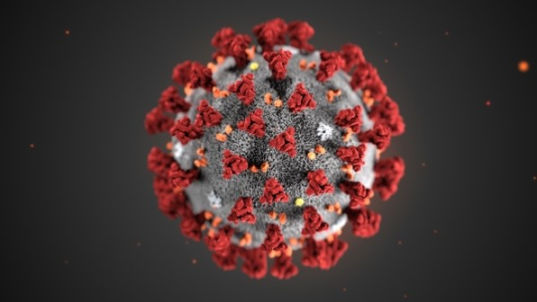

# 메인 컨셉

문명6 이미지

  

- Civilization

 - 나라마다 "Civilization" 이있고 그 문명을 발전시키는 게임

- AI 모드 , 멀티모드 지원

- 턴 방식 전략 시뮬레이션

  

# 서브 컨셉

## 국가   

- 기술 & 정책

- 기술&정책이 존재함으로서  국가운영을 하게됨

- 기술&정책을 제정하면서 생기는 변수들을 대체해야하는 전략적인 요소도 포함

  

## 특수지구  

 

  

- 각나라마다 고유의 특수지구가 있음 

   EX) 프랑스: 극장가 건설소요시간 -40%  , 미국: military 2단계 달성시 전투력 보너스 +5   , 한국:  campus에 추가 보너스 +30%

- 고유의 특수지구가 있음으로 루즈함이 없어지고  전략적으로 국가를 발전시킬수있게됨

  

## 이벤트

 

 

-2가지:  바이러스 창궐(턴제한), 환경오염도에 따른 자연현상부여 

위에서 설명한것과같이 바이러스 창궐과 환경오염에 따른 이벤트가 발생될때 유저만의 국가를 운영(대처)하면서 유저들의 운영데이터중 선별하여 기획하는의미를 담고있음

