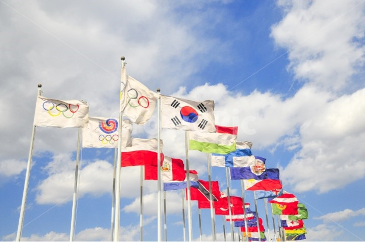
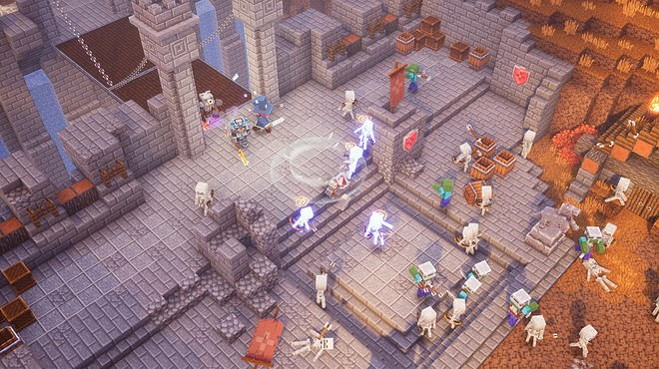
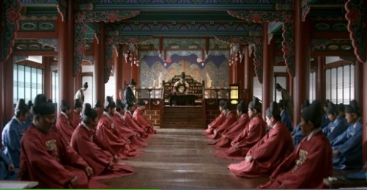
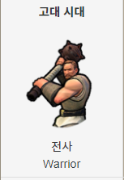
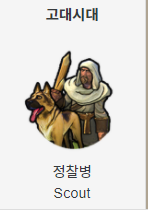
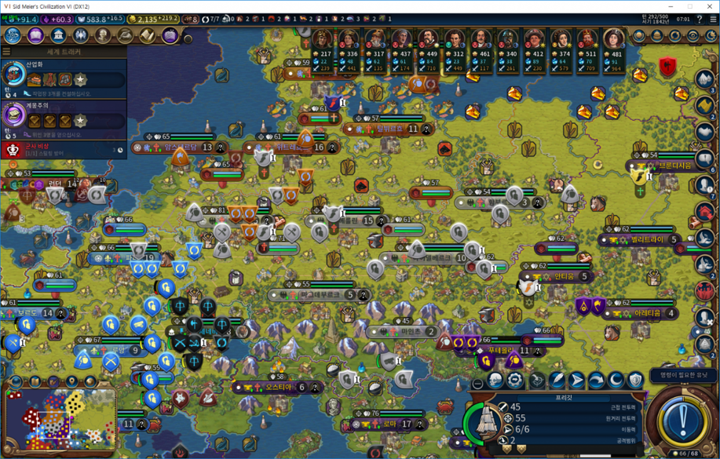
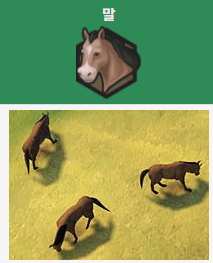
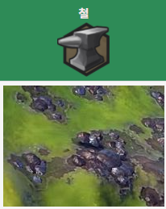

## Index

 

1.[Main Concept](#-Main-Concept)  
2.[메커니즘](#메커니즘)  
3.[기술](#기술)  
4.[스토리](#스토리)  
5.[참신함](#참신함)  
6.[이미지](#이미지)  
7.[미적요소](#미적요소)  
8.[게임 오브젝트 분해](#게임-오브젝트-분해)  
9.[피라미터 뽑아 보기](#피라미터-뽑아-보기)  
10.[요구사항](#요구사항)

# Main Concept

  

 

> Civilization

 - 나라마다 "Civilization" 이있고 그 문명을 발전시키는 게임

- AI 모드 , 멀티모드 지원

- 턴 방식 전략 시뮬레이션

  

## Sub concept

> 국가   

- 기술 & 정책

- 기술&정책이 존재함으로서  국가운영을 하게됨

- 기술&정책을 제정하면서 생기는 변수들을 대체해야하는 전략적인 요소도 포함

  

> 특수지구  

 

  

- 각나라마다 고유의 특수지구가 있음 

   EX) 프랑스: 극장가 건설소요시간 -40%  , 미국: military 2단계 달성시 전투력 보너스 +5   , 한국:  campus에 추가 보너스 +30%

- 고유의 특수지구가 있음으로 루즈함이 없어지고  전략적으로 국가를 발전시킬수있게됨

  

> 이벤트

 

 

- 2가지:  바이러스 창궐(턴제한), 환경오염도에 따른 자연현상부여 

위에서 설명한것과같이 바이러스 창궐과 환경오염에 따른 이벤트가 발생될때 유저만의 국가를 운영(대처)하면서 유저들의 운영데이터중 선별하여 기획하는의미를 담고있음

 

> 어드벤쳐

- 탐험: 국가 운영시 필요한 자우너을 탐험기능을 통해서 얻을수있고 이벤트의 해결방법중 하나 
ex) 00자원을 탐험을 통해 얻게되면 00건물 건설 가능 / 백신재료를 탐험을 통해 얻을수있음

- 레이드: 시대마다 등장하는 보스몹들이 존재 
ex)중세시대: 드래곤/ 미래시대: 외계인

 

> 모드

- Ai 대전 모드 & 멀티 대전 모드  

6단계의 ai 난이도를 통해서 단계상승의 재미를 포함하고 있으며 멀티 대전을 통해서 전략을 한단계 더 개발하게됨

- Vr 운영 모드  

vr기기를 통해서 국가운영과 동시에 각종 이벤트등을 심감나게 느낄수있음
ex)화산폭팔, 바이러스 창궐시 대처요령습득

  

# [Related Videos]

  

> 문명6게임 모티브 전체적인 틀 소개 영상  

[G스토리](https://www.youtube.com/watch?v=pxVOMXOqW_U)

> VR모드 관련 영상자료  

[지하철 화재 vr](https://www.youtube.com/watch?v=mdhnwzniqRI)

  

# [Details]  

## 메커니즘

[도전과제]

1. 메인퀘스트를 진행하면서 국가건설을 진행하라  

2. 국가 경쟁 퀘스트를 수행하면서 순위권에 들어라  

- ai대전: 국가 경쟁 퀘스트 = 환경오염, 바이러스 대처 이벤트  

- 멀티대전: 정복, 문화기여도, 우주기지건설, 외교력점수등 점수를 합산하여 순위매김

 

## 기술
  
- 기본베이스는 Unity engine  
- 유니티 vr기술을 사용함으로서 앞으로 현실세계에서 닥칠 자연재해등을 미리 대처할수있는 기능삽입

 

## 스토리

- 전반적인 흐름
한국: 아버지를 통해서 "광대"를 직업으로 배운 한 소년이 광장에서 널뛰기 공연을 마치고 집으로 돌아와서 보게되는 "하나의 유언장"  
그 유언장을 통해서 광대(user)는 망해가는 나라를 운영하기 위해서 준비하기 시작하는데..  

이야기는 총3가지파트로 예정되어있으며 오픈베타를 통해서 한국을 먼저 선보일예정이고 업데이트를 통해서 나머지 국가도 선보일예정

 

## 참신함

- 고전적인 진행방식(자연스럽지 못한 스토리전계)가 아닌 자연스럽게 이어지는 스토리 진행방식을 채택하여 게임 몰입도를 올린점.  

- Vr모드를 통해서 내가 직접 국가운영에 위기가 왔을때 혹은 재난이왔을때 실시간으로 
접하고 대처할수있다는점  

- 단순한 Rpg형식이 아닌 전략시뮬레이션도 포함시킴으로 인해서 캐릭터육성, 전략적 국가 운영,
이벤트 달성등 지속적인 업데이트를 통해 신규유저양성 및 기존유저유지를 할수있다는점  

 

## 이미지
  

- 국가운영을 하면서 일어나는 "전쟁"과 "자연재해"가 발생했을떄 대처해나가는 광대(User)의 모습

 

## 미적요소

- 디자인  

메인Ui에 3가지의 국가인 한국, 미국, 프랑스의 고유 지구를 표현  

ex) 한국: 경복궁, / 프랑스: 에펠탑  / 미국: 브로드웨이  

 

- 컬러

메인Ui : 각 퀘스트 진행도에 따라 배경이 바뀜 / 설정을 통해서 메인UI를 고정시킬수있음   

ex) Quest: 광대(User)가 000npc와 동행하여 000던전클리어 

서브Ui(국가건설맵):   

시대가 변할때마다 사계절 표현을 넣어 실감을 표현  

 

- 음향 - 저작권 범위내에서 선별예정

Menu sound: 한국 고유의 전통악기를 베이스로 하여 한국전통악기를 알릴예정 

Main ui sound: 각 나라의 고유 악기를 베이스로 하여 만듬

war sound: 긴장감 넘치는 일렉음악을 삽입 
 

     

## 게임 오브젝트 분해  
> 구성요소 분석

|연변|오브젝트 이름|오브젝트 이미지|  
|:---:|:---|:---:|
|1|건설자,  개척자| |  
|2|군사유닛||  
|3|종교유닛||  
|4|정찰유닛||  
|5|맵||  
|6|자원| | 

  

## 피라미터 뽑아 보기  
>속성 뽑아 보기

|속성|속성값|설명|비고|  
|:---:|:---|:---:|---|  
|이름|건설자|||  
|생산 비용|50 (생산력)|||  
|유지비용|없음|||  
|구매 비용|100 (금)|이후 +20금씩 비용 늘어남||  

 

|속성|속성값|설명|비고|  
|:---:|:---|:---:|---|  
|이름|개척자|||  
|생산 비용|100 (생산력)|||  
|유지비용|없음|||  
|구매 비용|450 (금)|이후 +100금씩 비용 늘어남||  

 

|속성|속성값|설명|비고|  
|:---:|:---|:---:|---|  
|이름|전사|||  
|생산 비용|40 (생산력)|||  
|유지비용|없음|||  
|구매 비용|150 (금)|||  

 

|속성|속성값|설명|비고|  
|:---:|:---|:---:|---|  
|이름|선교사|||  
|생산 비용|30 (신앙력)|||  
|유지비용|없음|||  
|구매 비용|100 (신앙)|||  

 

|속성|속성값|설명|비고|  
|:---:|:---|:---:|---|  
|이름|정찰병|||  
|생산 비용|20 (생산력)|||  
|유지비용|없음|||  
|구매 비용|110 (금)|||  

 

|속성|속성값|설명|비고|  
|:---:|:---|:---:|---|  
|이름|맵|||  
|면적|총 4개의 면적|소형, 중형, 대형, 초대형||
|지형특성|총 4개의 특성|고지, 판게아, 대륙, 지구맵||  
|재앙강도|총 7단계|제작중||  
|자원빈도|총 3단계|희박, 보통, 풍족||  

    

> 행동 뽑아 보기  

1)오브젝트 이름: 건설자  

|행동|설명|  
|:--:|:--|  
|이동력|2타일|  
|건설 가능횟수|2회|  
|요새 건설가능횟수|2회|  
|도로 건설가능횟수|2회|  

 

1)오브젝트 이름: 개척자  

|행동|설명|  
|:--:|:--|  
|이동력|2타일|  
|건설 가능횟수|2회|  

   

2)오브젝트 이름: 군사유닛(근접)  

|행동|설명|  
|:--:|:--|  
|이동력|근접: 2타일, 경기병: 4~5타일, 중기병: 2~4타일|  
|근접 전투력|초반 20전투력 시대마다 20씩오름|  
|원거리 전투력|없음|  
|공격범위|1타일|  

 

3)오브젝트 이름: 군사유닛(원거리)  

|행동|설명|  
|:--:|:--|  
|이동력|원거리:2타일~3타일, 공성무기: 2타일, 성:2타일|  
|근접 전투력|초반 10전투력 시대마다 15씩오름|  
|원거리 전투력|초반 30전투력 시대마다 20씩오름(포격 전투력도 마찬가지)|  
|공격범위|2~3타일(유닛보너스로 최대 +2범위증가)|  

 

4)오브젝트 이름: 종교유닛  

|행동|설명|  
|:--:|:--|  
|이동력|3타일 ~ 5타일|  
|신앙력|선지자: 200 , 사도: 최대 130, 선교사:50|  
|개종|최소 2회~ 최대6회|  

 

3)오브젝트 이름: 정찰유닛  

|행동|설명|  
|:--:|:--|  
|이동력|3타일|  
|근접 전투력|초반 15전투력 시대마다 15씩오름|  
|원거리 전투력|초반 20전투력 시대마다 10씩오름|  
|공격범위|1~2타일|  

    

>상태 뽑아 보기

1) 전투 유닛  

|현상태|전이상태|전이조건|  
|:---:|:---|---|  
|전투|부상|currentHealthPoints = currentHealthPoints - x;|  
|부상|회복|currentHealthPoints = currentHealthPoints  + x;|  
|정상|전투|public Combat unit attack(GameObject unit, GameObject enemy)  ....|  
|전투|사망|if(other.gameObject.tag ==   " die"){health  =  0;}|  

 

2) 비전투 유닛  

|현상태|전이상태|전이조건|  
|:---:|:---|---|  
|정상|이동|tile.translate(moveDir.normalized * movespeed * Time.deltaTime, space.Self);|  
|이동|부상|currentHealthPoints = currentHealthPoints - x;|  
|부상|회복|currentHealthPoints = currentHealthPoints  + x;
|부상|사망|if(other.gameObject.tag ==   " die"){health  =  0;}|  

  

>유닛 캐릭터속성(파라미터)  

|속성|영문명칭|설명|비고|  
|-----|:----|----|----|  
|레벨|Level|유닛마다 레벨이 있으며 전투시 얻은 Wp(warPoint)를 통해 진급할 수 있다.||  
|경험치|Exp|전투를 통해서 경험을 쌓을 수 있다 다만 종교유닛의 경우 전투가 아닌 건물 업그레이드를 통해서 진급가능하다.|유닛처치시 3~5(random)exp  포격시 : 5exp , 성 점령시: 20exp|  
|체력|Hp|유닛마다 고유의 체력을 가진다 다만 종교유닛의 경우 회복을 하기 위해서 성지로 가야한다.|시대변화수치: 근접: +20h, 원거리: +10hp|  
|진급|Upgrade|진급은 총 4진급으로 구성되어있으며 근접, 원거리, 포격유닛, 종교유닛 총 4개의 트리로 구성되어있다.|ex) 창병3진급 : 경기병 상대시 +7전투력|  
|이동력|Mobility|타일을 이동하기위해서 필요한 시스템이다 다만 언덕과 숲등에서는 패널티가 존재한다.|근접, 원거리는 기본 2타일 , 정찰유닛, 종교유닛은 3타일 이동가능하다 이는 진급을 통해서 늘릴 수 있다.|  
|전투력|Power|유닛의 전투력을 나타내는 수치이다 진급과 시대변화를 통해서 올릴 수 있다.|시대변화수치: 근접: +20 전투력, 원거리: +10 전투력, 포격: +10 전투력|  
|경계|boundary|유닛 경계시 적이 1타일 이내로 들어올시 자동으로 전투준비를 할 수 있는 시스템이며 다음턴에 공격가능하다.||  
|방어|Df|유닛마다 고유의 df값이 있으며 적에게 받는 피해들을 받아내는 시스템.|시대변화수치: 근접: +10df, 원거리: +5df|  

  

>게임의 규칙  

1) 핵심 규칙
 승리와 패배 
- 과학승리, 문화승리, 종교승리, 정복승리 총 4가지의 승리 방법이 있으며 
반대로 다른 문명이 승리할 때까지 어떤 승리 조건도 달성하지 못하거나, 또는 마지막 도시가 함락당하게 되면 
패배한다.

2) 보조 규칙
- 행복도: 인구성장과 여러 요소들에의해 국민들의 행복도 수치이다  전쟁, 재난등으로 인해 행복도가 줄어들수있으며
이는 도시성장에 영향을 끼치게된다. 행복도는 특수지구와 외교를 통해서 올릴 수 있다. 
- 주거공간: 인구성장에 따른 주거공간 수치이다 예를 들어 강,바다가 껴있는도시는 +2주거공간이지만 사막, 숲타일은 주거공간 보너스가 없어 특수지구를 통해 늘려야한다.
- 외교: 국내외 교역을 통해서 쌓을수 있는 수치이다. 외교실패 or 전쟁협상실패시 행복도에 영향이가게된다.
외교는 특수지구를 통해 해결이아닌 유저의 선택에 따라 흘러간다.
- 인구 성장: +1 성장마다 +1 타일이 늘어나며 생산력과 식량 연구, 문화 등 늘어나게된다 다만 행복도는 반비례관계
- 충성도: 0~100 까지 충성도값이 있고 70이하부터 도시의 생산력과 성장에 패널티가 적용된다.
- 특수지구: 국가마다 특수지구를 지을수있으며 도시성장에 큰 기여를 한다. 다만 인구에 비례해서 지을수있으며 
과학지구, 문화지구, 유흥지구, 종교지구, 정부, 상업지구 등등이 있다.  

  

>게임에서 사용될 공식  

1. 인구성장 
->Food=15+8∗(n−1)+(n−1)1.5 
(n은 인구수)
-> 타일증가 = n+1(n은 인구수)

2. 행복도
인구의 절반(소수점 올림)-1

  

# 요구사항 

## 광대 미션의 1년치 요구사항

> Menu

- 시작화면, 게임화면, 설정화면,  총 3개의 화면이 있다.
- 시작화면에는 Single play, Multi play, Game option,Tutorial라는 버튼 4개가있다

> Single play  

- Single play 클릭시 New game, load game 이 있다.
- New game 클릭시 Game setting으로 넘어간다.
- Game setting에서는 플레이어 문명선택, 게임난이도, 시작시대, 지도선택, 승리조건 선택이있다.
- 문명은 총 3가지(미국, 한국, 프랑스) / 게임난이도는 3단계(상, 중, 하) / 시대는 고대,고전,중세,르네,산업,현대,미래시대로 총7개로 구성되어있다.
- 지도는 판게아, 지구맵, 대륙으로 구성되어있다. / 승리조건은 과학승리, 문화승리, 종교승리, 정복승리로 총4가지이다.

> Multi play  
- 인터넷을 통해서 최대 4인이상 멀티 플레이가 가능하다  

> Game option  
- 게임, 그래픽, 오디오, 언어, 인터페이스, 단축키 6가지 버튼이 있다.
- 게임 버튼을 누르면 빠른전투, 빠른이동, 자동 턴 종료의 옵션을 활성화/비활성화 할수있다.
- 그래픽 버튼을 누르면 해상도 선택과 창모드선택이 가능하다
- 언어 버튼을 누르면 영어, 한국어 2가지 기능중 한개를 선택할수있다.
- 인터 페이스 버튼을 누르면 미니맵 크기, 마우스를 창에 고정, 자동 유닛 순환기능을 활성화/비활성화중 한개를 선택할수있다.
- 단축키 버튼을 누르면 1~10번까지의 단축키를 나만의 스타일로 변경할수있다.  

> Tutorial  
- 튜토리얼 8단계 코스로 진행된다
- 1단계: 게임시작단계
- 2단계: 내부플레이(국가건설)
- 3단계: 내부플레이(특수지구 건설)
- 4단계: 기술&정책소개
- 5단계: 과학승리방법 소개후 진행(완료는 선택사항)
- 6단계: 문화승리방법 소개후 진행(완료는 선택사항)
- 7단계: 종교승리방법 소개후 진행(완료는 선택사항)
- 8단계: 지배승리방법 소개후 진행(완료는 선택사항)

> Game play

- 게임화면에서 상단에는 각 문명의 과학,문화,신앙,금 산출량이 보여지고 중단에는 각 타일 국가가 문명을 개설하는 모습 하단에는 지도맵과 턴을 넘기는 ui삽입
- 과학승리는 기술&정책에 의해 영향을 받으며 최종 우주개척 4단계를 건설시 승리하게되는 방식으로 진행된다. (기술&정책은 미정)
- 우주개척 4단계: 인공위성 건설 및 발사 -> 우주정거장 건설 -> spaceship건설 -> 000행성 도착&개척
- 문화승리는 각 문명의 문화산출량을 점수화해서 통계내는 방식으로 진행된다 문화산출량은 특수지구를통해 문화가 증가하게되고 외교를 통해 관광을 늘릴수있다.
- 종교승리는 각 문명의 종교가 전 문명을 개종했을때 종교승리를 하는 방식이다 신앙산출량은 특수지구를 통해 신앙이 증가하게되고 외교&선교사를 통해 종교를 전파할수있다.
- 지배승리는 각 문명의 지배국가수를 기준으로 통계내는 방식으로 진행된다. 제일 많이 정복한 문명이 승리하게된다.
- 게임시작후 각 문명은  시대변화(변화당 20턴)를 거치면서 성장하게되고 총 4가지의 승리방법으로 운영하게된다.  

> Interface  
- 조작은 마우스 기본베이스이고 키보드는 1~10 숫자버튼을 통해 ui조작이 가능하다 ex)1번 맵의 지리적특성확인, 2번 행복도확인, 3번 도시확인  

> Game End
- 게임의 종료 조건은 총 4가지의 승리방법(과학승리, 문화승리, 종교승리, 지배승리)중 한개를 달성하면 미션달성이다.
- 게임을 일시정지 할수있고 save, load기능을 통해서 언제든지 다시 플레이할수있다.
- 게임 종료시 각 문명당 스코어창이 뜨고  스코어창에는 과학진행도,문화전파도,종교전파도,지배횟수가 나오게된다

    

>광대 미션의 6주치 요구사항  

> Menu

- 시작화면, 게임화면, 설정화면,  총 3개의 화면이 있다.
- 시작화면에는 Single play, Multi play, Game option,Tutorial라는 버튼 4개가있다

> Single play  

- Single play 클릭시 New game, load game 이 있다.
- New game 클릭시 Game setting으로 넘어간다.
- Game setting에서는 플레이어 문명선택, 게임난이도, 시작시대, 지도선택, 승리조건 선택이있다.
- 문명은 총 3가지(미국, 한국, 프랑스) / 게임난이도는 3단계(상, 중, 하) / 시대는 고대,고전,중세,르네,산업,현대,미래시대로 총7개로 구성되어있다.
- 지도는 판게아, 지구맵, 대륙으로 구성되어있다. / 승리조건은 과학승리, 문화승리, 종교승리, 정복승리로 총4가지이다.

> Multi play  
- 인터넷을 통해서 최대 4인이상 멀티 플레이가 가능하다  

> Game option  
- 게임, 그래픽, 오디오, 언어, 인터페이스, 단축키 6가지 버튼이 있다.
- 게임 버튼을 누르면 빠른전투, 빠른이동, 자동 턴 종료의 옵션을 활성화/비활성화 할수있다.
- 그래픽 버튼을 누르면 해상도 선택과 창모드선택이 가능하다
- 언어 버튼을 누르면 영어, 한국어 2가지 기능중 한개를 선택할수있다.
- 인터 페이스 버튼을 누르면 미니맵 크기, 마우스를 창에 고정, 자동 유닛 순환기능을 활성화/비활성화중 한개를 선택할수있다.
- 단축키 버튼을 누르면 1~10번까지의 단축키를 나만의 스타일로 변경할수있다.  

> Tutorial  
- 튜토리얼 8단계 코스로 진행된다
- 1단계: 게임시작단계
- 2단계: 내부플레이(국가건설)
- 3단계: 내부플레이(특수지구 건설)
- 4단계: 기술&정책소개

> Game play

- 게임화면에서 상단에는 각 문명의 과학,문화,신앙,금 산출량이 보여지고 중단에는 각 타일 국가가 문명을 개설하는 모습 하단에는 지도맵과 턴을 넘기는 ui삽입
- 과학승리는 기술&정책에 의해 영향을 받으며 최종 우주개척 4단계를 건설시 승리하게되는 방식으로 진행된다. (6주치에는 지배승리만 개발)

> Interface  
- 조작은 마우스 기본베이스이고 키보드는 1~10 숫자버튼을 통해 ui조작이 가능하다 ex)1번 맵의 지리적특성확인, 2번 행복도확인, 3번 도시확인  

> Game End
- 게임의 종료 조건은 총 4가지의 승리방법(과학승리, 문화승리, 종교승리, 지배승리)중 한개를 달성하면 미션달성이다.
- 게임을 일시정지 할수있고 save, load기능을 통해서 언제든지 다시 플레이할수있다.
- 게임 종료시 각 문명당 스코어창이 뜨고  스코어창에는 과학진행도,문화전파도,종교전파도,지배횟수가 나오게된다
