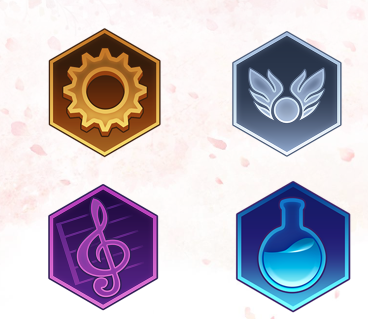

# Main Concept

- Civilization

 - 나라마다 "Civilization" 이있고 그 문명을 발전시키는 게임

- AI 모드 , 멀티모드 지원

- 턴 방식 전략 시뮬레이션

  

## Sub concept

> 국가   

- 기술 & 정책

- 기술&정책이 존재함으로서  국가운영을 하게됨

- 기술&정책을 제정하면서 생기는 변수들을 대체해야하는 전략적인 요소도 포함

  

> 특수지구  

 

  

- 각나라마다 고유의 특수지구가 있음 

   EX) 프랑스: 극장가 건설소요시간 -40%  , 미국: military 2단계 달성시 전투력 보너스 +5   , 한국:  campus에 추가 보너스 +30%

- 고유의 특수지구가 있음으로 루즈함이 없어지고  전략적으로 국가를 발전시킬수있게됨

  

> 이벤트

 

 

- 2가지:  바이러스 창궐(턴제한), 환경오염도에 따른 자연현상부여 

위에서 설명한것과같이 바이러스 창궐과 환경오염에 따른 이벤트가 발생될때 유저만의 국가를 운영(대처)하면서 유저들의 운영데이터중 선별하여 기획하는의미를 담고있음

 

> 어드벤쳐

- 탐험: 국가 운영시 필요한 자우너을 탐험기능을 통해서 얻을수있고 이벤트의 해결방법중 하나 
ex) 00자원을 탐험을 통해 얻게되면 00건물 건설 가능 / 백신재료를 탐험을 통해 얻을수있음

- 레이드: 시대마다 등장하는 보스몹들이 존재 
ex)중세시대: 드래곤/ 미래시대: 외계인

 

> 모드

- Ai 대전 모드 & 멀티 대전 모드  

6단계의 ai 난이도를 통해서 단계상승의 재미를 포함하고 있으며 멀티 대전을 통해서 전략을 한단계 더 개발하게됨

- Vr 운영 모드  

vr기기를 통해서 국가운영과 동시에 각종 이벤트등을 심감나게 느낄수있음
ex)화산폭팔, 바이러스 창궐시 대처요령습득

  

# [관련동영상]

  

> 문명6게임 모티브 전체적인 틀 소개 영상  

[G스토리](https://www.youtube.com/watch?v=pxVOMXOqW_U)

> VR모드 관련 영상자료  

[지하철 화재 vr](https://www.youtube.com/watch?v=mdhnwzniqRI)

  

# [Details]  

## 메커니즘

[도전과제]

1. 메인퀘스트를 진행하면서 국가건설을 진행하라  

2. 국가 경쟁 퀘스트를 수행하면서 순위권에 들어라  

- ai대전: 국가 경쟁 퀘스트 = 환경오염, 바이러스 대처 이벤트  

- 멀티대전: 정복, 문화기여도, 우주기지건설, 외교력점수등 점수를 합산하여 순위매김

 

## 기술
  
- 기본베이스는 Unity engine  
- 유니티 vr기술을 사용함으로서 앞으로 현실세계에서 닥칠 자연재해등을 미리 대처할수있는 기능삽입

 

## 스토리

- 전반적인 흐름
한국: 아버지를 통해서 "광대"를 직업으로 배운 한 소년이 광장에서 널뛰기 공연을 마치고 집으로 돌아와서 보게되는 "하나의 유언장"  
그 유언장을 통해서 광대(user)는 망해가는 나라를 운영하기 위해서 준비하기 시작하는데..  

이야기는 총3가지파트로 예정되어있으며 오픈베타를 통해서 한국을 먼저 선보일예정이고 업데이트를 통해서 나머지 국가도 선보일예정

 

## 참신함

- 고전적인 진행방식(자연스럽지 못한 스토리전계)가 아닌 자연스럽게 이어지는 스토리 진행방식을 채택하여 게임 몰입도를 올린점.  

- Vr모드를 통해서 내가 직접 국가운영에 위기가 왔을때 혹은 재난이왔을때 실시간으로 
접하고 대처할수있다는점  

- 단순한 Rpg형식이 아닌 전략시뮬레이션도 포함시킴으로 인해서 캐릭터육성, 전략적 국가 운영,
이벤트 달성등 지속적인 업데이트를 통해 신규유저양성 및 기존유저유지를 할수있다는점  

 

## 이미지
  

- 국가운영을 하면서 일어나는 "전쟁"과 "자연재해"가 발생했을떄 대처해나가는 광대(User)의 모습

 

## 미적요소

- 디자인  

메인Ui에 3가지의 국가인 한국, 미국, 프랑스의 고유 지구를 표현  

ex) 한국: 경복궁, / 프랑스: 에펠탑  / 미국: 브로드웨이  

 

- 컬러

메인Ui : 각 퀘스트 진행도에 따라 배경이 바뀜 / 설정을 통해서 메인UI를 고정시킬수있음   

ex) Quest: 광대(User)가 000npc와 동행하여 000던전클리어 

서브Ui(국가건설맵):   

시대가 변할때마다 사계절 표현을 넣어 실감을 표현  

 

- 음향 - 저작권 범위내에서 선별예정

Menu sound: 한국 고유의 전통악기를 베이스로 하여 한국전통악기를 알릴예정 

Main ui sound: 각 나라의 고유 악기를 베이스로 하여 만듬

war sound: 긴장감 넘치는 일렉음악을 삽입 

