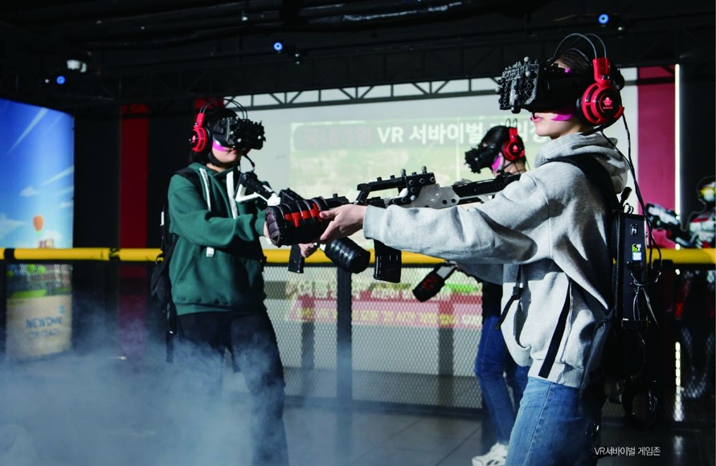
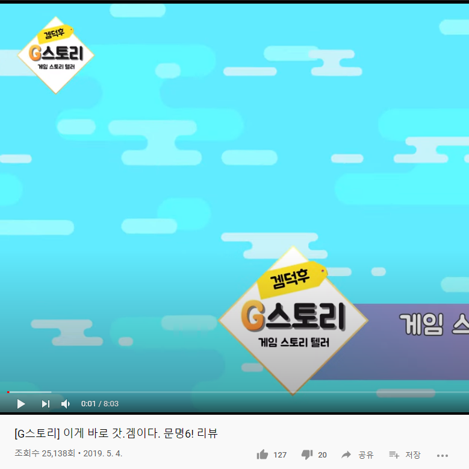

# 메인 컨셉

- Civilization

 - 나라마다 "Civilization" 이있고 그 문명을 발전시키는 게임

- AI 모드 , 멀티모드 지원

- 턴 방식 전략 시뮬레이션

  

# 서브 컨셉

## 국가   

- 기술 & 정책

- 기술&정책이 존재함으로서  국가운영을 하게됨

- 기술&정책을 제정하면서 생기는 변수들을 대체해야하는 전략적인 요소도 포함

  

## 특수지구  

 

  

- 각나라마다 고유의 특수지구가 있음 

   EX) 프랑스: 극장가 건설소요시간 -40%  , 미국: military 2단계 달성시 전투력 보너스 +5   , 한국:  campus에 추가 보너스 +30%

- 고유의 특수지구가 있음으로 루즈함이 없어지고  전략적으로 국가를 발전시킬수있게됨

  

## 이벤트

 

 

- 2가지:  바이러스 창궐(턴제한), 환경오염도에 따른 자연현상부여 

위에서 설명한것과같이 바이러스 창궐과 환경오염에 따른 이벤트가 발생될때 유저만의 국가를 운영(대처)하면서 유저들의 운영데이터중 선별하여 기획하는의미를 담고있음

 

## 어드벤쳐

- 탐험: 국가 운영시 필요한 자우너을 탐험기능을 통해서 얻을수있고 이벤트의 해결방법중 하나 
ex) 00자원을 탐험을 통해 얻게되면 00건물 건설 가능 / 백신재료를 탐험을 통해 얻을수있음

- 레이드: 시대마다 등장하는 보스몹들이 존재 
ex)중세시대: 드래곤/ 미래시대: 외계인

 

## 모드

- Ai 대전 모드 & 멀티 대전 모드  

6단계의 ai 난이도를 통해서 단계상승의 재미를 포함하고 있으며 멀티 대전을 통해서 전략을 한단계 더 개발하게됨

- Vr 운영 모드  

vr기기를 통해서 국가운영과 동시에 각종 이벤트등을 심감나게 느낄수있음
ex)화산폭팔, 바이러스 창궐시 대처요령습득

  

# 관련동영상

  
- 문명6게임 모티브 전체적인 틀 소개 영상  

[G스토리](https://www.youtube.com/watch?v=pxVOMXOqW_U)

- VR모드 관련 영상자료  

[지하철 화재 vr](https://www.youtube.com/watch?v=mdhnwzniqRI)

