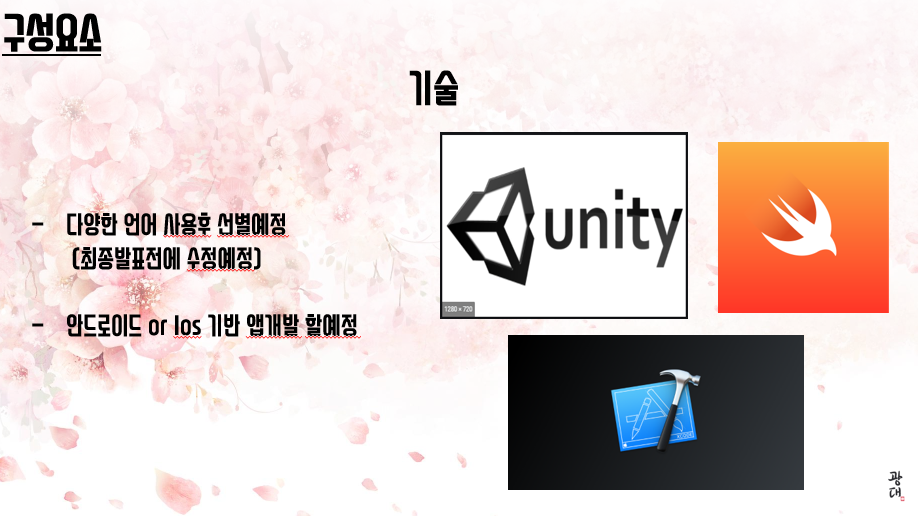
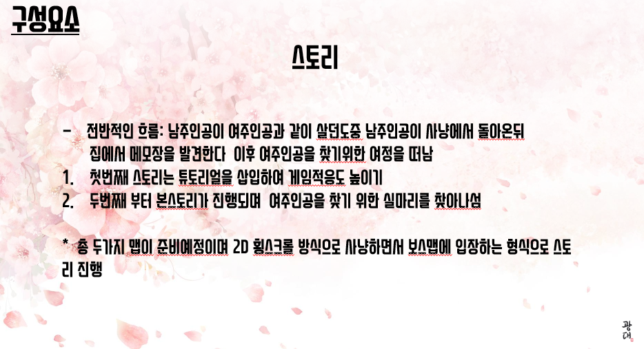
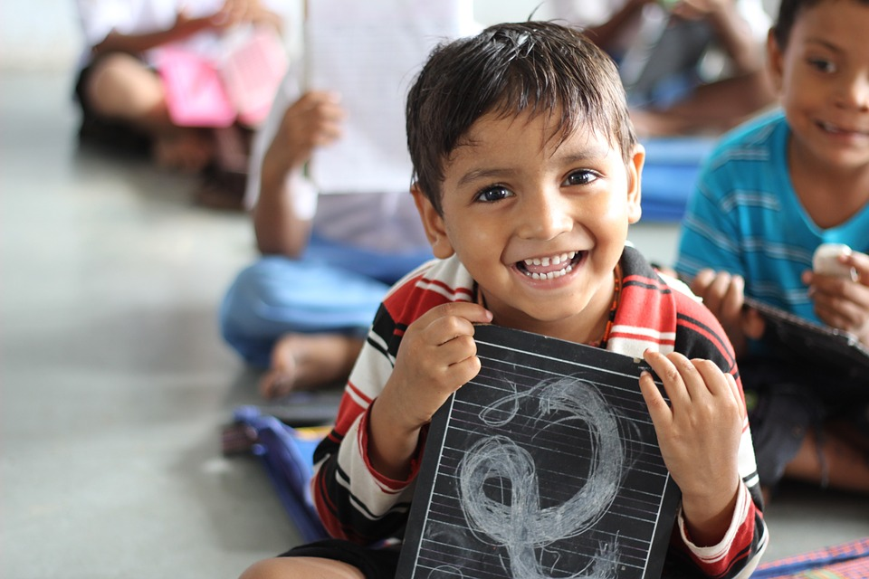
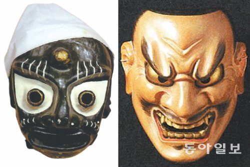
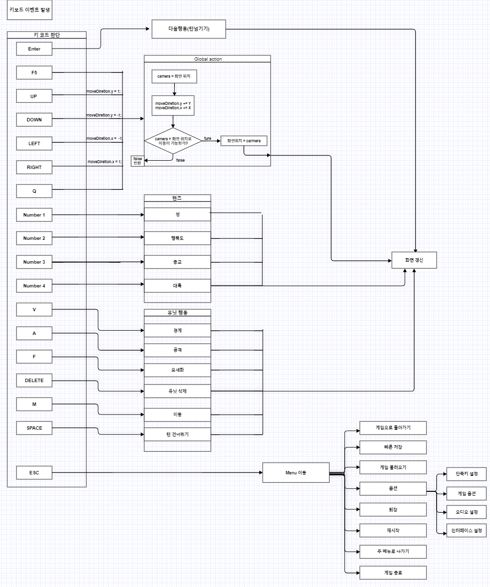
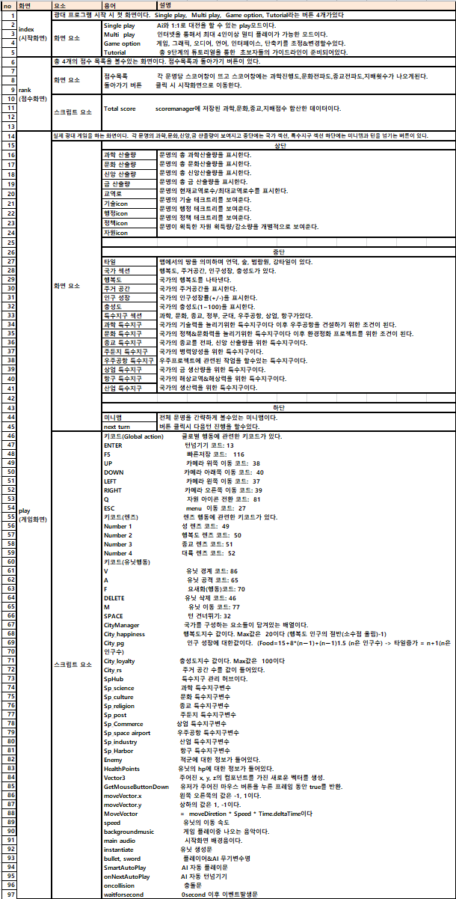

# 광대 created by ms  
## Season 2

 

[1.게임명: 광대](#광대)  
[2.컨셉](#컨셉)   
[3.대표 이미지](#대표-이미지)  
[4.광대 게임 구성요소](#광대-게임-구성요소)  

[5.게임시스템디자인](#게임시스템디자인)  
   -  [a.게임 오브젝트 분해](#게임-오브젝트-분해)  
   -  [b.파라미터(속성)](#파라미터속성)  
   -  [c.행동](#행동)    
   
[6.개발 요구사항 & 흐름도](#개발-요구사항--흐름도) 
   -  [b.요구사항(12주)](#요구사항12주)  
   -  [c.키보드 이벤트에 대한 흐름도](#키보드-이벤트에-대한-흐름도)  
   -  [d.용어정리](#용어정리)  
   
[7.12주간 계획표](#12주간-계획표)  

   

# 개발 진행도  

    

# 컨셉  

## Main Concept

> 종합게임(2종류)

 

Jump & Run Game  

3가지 포인트  

1. Jump & Run Game
-> Trap과 캐릭터의 기능 jump & run을 통해서 게임을 이어나가는 방식  

2.  경쟁
-> coin 획득량 과 타임어택의 바탕으로 된 Score를 통해서 지인들과 경쟁을 할수있습니다.  

3. 스토리
->  초반부 스토리를 통해서 시작하게 되며  몹에서 드롭되는 지도조각을 얻음으로서 
스토리를 이어나가는식 (추후 개발예정)  

  

## Sub concept

> character

- 캐릭터마다의 스토리 도입 (ex 승리시 광대의 하수인이 들고있는 지도의 조작을 얻게됨)

-  랭킹 시스템 도입(멀티플레이) 
-> 멀티플레이는 추후 개발예정

- Attack 기능은 jump kill을 base로 두고있으며 추후 다양한 무기시스템 도입예정

  

> Monster

 

  
 

-  총 6가지의 monster 구현 예정 (1학기때에는 2~3개 구현예정)

-  Raycast를 이용한 방향전환 및 낙하방지

-  Monster마다 attack Animation을 2가지로 계획예정 
-> 1.  Body attack, Bullet attack  

> Trap

 

  

-  Spike를 통해서 피격시 hp -1 효과 구현

-  +1, -1 item을 먹을시  시간 증감 발생

-  톱니, 화염지대는 추후 개발예정  

> Item

 

  

각 Coin마다의 점수가 존재  

- Bronze coin = 50  

- Silver coin = 100  

- Gold coin = 300  

- 추후 hp 포션등 개발 예정

 # 대표 이미지

 

 

# 광대 게임 구성요소

## 메커니즘

[도전과제]

[도전과제]

-  메인 퀘스트를 진행하면서 지도를 완성시켜라  

-  지도 완성후 여주인공을 구출하라  

   

 > 룰  

- 기존의 고스톱, 테트리스와 동일  but  데스메치,  돌발퀴즈등  룰 추가

 

## 기술
  

 

## 스토리  

  

 

## 참신함  

-  고전적인 스토리 진행방식이 아닌 반전 스토리 진행방식을 채택하여 게임 몰입도를 올린점.  

-  또한 기존게임의 진행방식의 룰에 +@(데스메치 등)하여 차별성을 둔점  
 
 

## 미적요소

> 디자인  

메인Ui에  한국과 미국의 고유배경을 씀  

Ex) 메인배경: 경복궁 유사그림 / 보스맵: 뒷배경을    꽃풍경  

> 컬러  

메인Ui : 각 퀘스트 진행도에 따라 배경이 바뀜 / 설정을 통해서 메인UI를 고정시킬수있음  

ex) Quest: 광대(User)가 000npc와 동행하여 000던전클리어  

> 음향 - 저작권 범위내에서 선별예정  

Menu sound: 한국 고유의 전통악기를 베이스로 하여 한국전통악기를 알릴예정  

Main ui sound: 각 나라의 고유 악기를 베이스로 하여 만듬  

war sound: 긴장감 넘치는 일렉음악을 삽입

     

# 게임시스템디자인

# 게임 오브젝트 분해  
> 구성요소 분석

|연변|오브젝트 이름|오브젝트 이미지|  
|:---:|:---|:---:|
|1|남자 주인공|| 
|2|여자 주인공||  
|3|광대||  
|4|제1 단장||  
|5|제2 단장||  

  

# 파라미터(속성)  
>속성 뽑아 보기  

### 아군

|속성|속성값|설명|비고|  
|:---:|:---|:---:|---|  
|이름|Blind|남자주인공의 첫번째 이름|Normal|  
|공격력|2|레벨당 + 1|MAX = 10|  
|방어력|2|레벨당 + 1|MAX = 10|  
|이동력|2|장비 업그레이드로 수치 증가|MAX = 4|
|체력|100|장비 업그레이드로 수치 증가|MAX = 300|

 

|속성|속성값|설명|비고|  
|:---:|:---|:---:|---|  
|이름| היו אטומים|남자주인공의 두번째 이름|각성|  
|공격력|4|레벨당 + 1|MAX = 12|  
|방어력|4|레벨당 + 1|MAX = 12|  
|이동력|3|장비 업그레이드로 수치 증가|MAX = 5|
|체력|200|장비 업그레이드로 수치 증가|MAX = 400|

 

|속성|속성값|설명|비고|  
|:---:|:---|:---:|---|  
|이름|Hope|여자주인공의 첫번째 이름|Npc|  
|공격력|0|변동없음||  
|방어력|0|변동없음||  
|이동력|2|변동없음||
|체력|100|변동없음||

 

|속성|속성값|설명|비고|  
|:---:|:---|:---:|---|  
|이름|לְשַׁחְרֵר|여자주인공의 두번째 이름|각성|  
|공격력|0|변동없음||  
|방어력|0|변동없음||  
|이동력|2|변동없음||
|체력|100|변동없음||

 

### 적군

|속성|속성값|설명|비고|  
|:---:|:---|:---:|---|
|이름|광대|최종보스|Normal|  
|공격력|10|페이즈별 변동있음|1페이즈|  
|방어력|1|페이즈별 변동있음|1페이즈|  
|이동력|4|페이즈별 변동있음|1페이즈|
|체력|1000|페이즈별 변동있음|1페이즈|

 

|속성|속성값|설명|비고|  
|:---:|:---|:---:|---|  
|이름|광대|최종보스|Hard|  
|공격력|15|페이즈별 변동있음|2페이즈|  
|방어력|4|페이즈별 변동있음|2페이즈|  
|이동력|4|페이즈별 변동있음|2페이즈|
|체력|1500|페이즈별 변동있음|2페이즈|  

 

|속성|속성값|설명|비고|  
|:---:|:---|:---:|---|  
|이름|화남|제1 단장|Normal|  
|공격력|5|페이즈별 변동있음|1페이즈|  
|방어력|2|페이즈별 변동있음|1페이즈|  
|이동력|3|페이즈별 변동있음|1페이즈|
|체력|500|페이즈별 변동있음|1페이즈|  

 

|속성|속성값|설명|비고|  
|:---:|:---|:---:|---|  
|이름|화남|제1 단장|Hard|  
|공격력|7|페이즈별 변동있음|2페이즈|  
|방어력|5|페이즈별 변동있음|2페이즈|  
|이동력|5|페이즈별 변동있음|2페이즈|
|체력|700|페이즈별 변동있음|2페이즈|  

   

|속성|속성값|설명|비고|  
|:---:|:---|:---:|---|  
|이름|불행|제2 단장|Normal|  
|공격력|6|페이즈별 변동있음|1페이즈|  
|방어력|3|페이즈별 변동있음|1페이즈|  
|이동력|2|페이즈별 변동있음|1페이즈|
|체력|700|페이즈별 변동있음|1페이즈|  

 

|속성|속성값|설명|비고|  
|:---:|:---|:---:|---|  
|이름|불행|제2 단장|Hard|  
|공격력|8|페이즈별 변동있음|2페이즈|  
|방어력|6|페이즈별 변동있음|2페이즈|  
|이동력|2|페이즈별 변동있음|2페이즈|
|체력|900|페이즈별 변동있음|2페이즈|  

 

|속성|속성값|설명|비고|  
|:---:|:---|:---:|---|  
|이름|몬스터1|필드지역몹|근접|  
|공격력|3|다음 단계당 +2||  
|방어력|2|다음 단계당 +2||  
|이동력|2|변동없음||
|체력|10|다음 단계당 + 10||  

 

|속성|속성값|설명|비고|  
|:---:|:---|:---:|---|  
|이름|몬스터2|필드지역몹|원거리|  
|공격력|4|다음 단계당 +2||  
|방어력|1|다음 단계당 +2||  
|이동력|2|변동없음||
|체력|5|다음 단계당 + 10|| 

    

# 행동  

1)오브젝트 이름: 건설자  

|행동|설명|  
|:--:|:--|  
|이동력|2타일|  
|건설 가능횟수|2회|  
|요새 건설가능횟수|2회|  
|도로 건설가능횟수|2회|  

    

# 상태  

1) 전투 유닛  

|현상태|전이상태|전이조건|  
|:---:|:---|---|  
|전투|부상|currentHealthPoints = currentHealthPoints - x;|  
|부상|회복|currentHealthPoints = currentHealthPoints  + x;|  
|정상|전투|public Combat unit attack(GameObject unit, GameObject enemy)  ....|  
|전투|사망|if(other.gameObject.tag ==   " die"){health  =  0;}|  

 

2) 비전투 유닛  

|현상태|전이상태|전이조건|  
|:---:|:---|---|  
|정상|이동|tile.translate(moveDir.normalized * movespeed * Time.deltaTime, space.Self);|  
|이동|부상|currentHealthPoints = currentHealthPoints - x;|  
|부상|회복|currentHealthPoints = currentHealthPoints  + x;
|부상|사망|if(other.gameObject.tag ==   " die"){health  =  0;}|  

  

# 게임의 규칙  

1) 핵심
- 승리와 패배의 조건
승리조건: 
1. 해당 Round마다 지도조각을 획득(총2개)  
3. 장애물을 피하면서 Stage 클리어
4. 지도를 완성시킨후 최종보스 처치

패배조건
1. 해당 Round마다 Player의 Hp가 완전히 소모 Game over 화면출력

  

# 개발 요구사항 & 흐름도

    

## 요구사항(12주)  

 

> Scean 기능 요구사항  

- 메뉴화면, 게임화면, 엔딩화면 총 3개의 화면이 있어야한다.  

- 메뉴화면에는 Game start, Setting, Tutorial 3개의 버튼이 있어야한다.  

- Game scean에서 save&load 기능이 있어야한다.   

- Retry 기능이 있어야한다.  

- Setting Scean 안에는 소리설정 기능이 있어야한다.  

> character 기능 요구사항  

- character 방향전환 기능이 있어야한다.  

- character jump 기능이 있어야한다.  

- character dash 기능이 있어야한다.  

- character 시선전환 기능이 있어야한다.  

- character Rigidbody 기능이 있어야한다.  

- character Attack 기능이 있어야한다.  

- character weapon upgrade 기능이 있어야한다.  

- character armor upgrade 기능이 있어야한다.  

- character Stats창이 있어야한다. 

- character inventory 기능이 있어야한다.  
  
- character death & resurrection 기능이 있어야한다.  

> Monster 기능 요구사항  

- Monster 방향전환 기능이 있어야한다.  

- Monster jump 기능이 있어야한다.  

- Monster 기능이 있어야한다.  

- Monster Rigidbody 기능이 있어야한다.  

- Monster Attack 기능이 있어야한다.  

- Monster death 기능이 있어야한다.  
 

>  boss 기능 요구사항 
- boss 2 단장 + 최종보스 총 3가지의 보스가 있어야한다.  

- 1단장의 컨셉은 화남을 가지고 있으며 지형은 불에 그흘린 지형이며 2가지의 패턴을 가지고 있다.  

- 1단장의 패턴: bullet 양방향으로 흩뿌리기(10초간격), 지형 불태우기  

- 2단장의 컨셉은 슬픔을 가지고 있으며 지형은 얼어붙은 지형이며 2가지의 패턴을 가지고 있다.  

- 2단장의 패턴: bullet 양방향으로 흩뿌리기(10초간격), 지형 얼어붙게 하기  

- 최종보스(광대)의 컨셉은 혼란을 가지고 있으며 지형은 전체적으로 어두운배경의 컨셉을 지니며 2가지의 패턴을 가지고 있다.  

- 최종보스의 패턴: bullet 양방향으로 흩뿌리기 , 암흑상태(실명)이 있다.  

   

> Trap 요구사항  

- spike 에 player가 피격당할시 hp -1 기능이 있어야한다. 
- 타임어택 기능이 있어야한다.  
- 타임어택 기능을 위해서 시간증감 아이템이 필요하다.  

> Item 요구사항  

- coin마다의 점수가 존재해야한다.  
  
- Bronze coin = 50  

- Silver coin = 100  

- Gold coin = 300  

- hp 포션이 있어야 하며 먹을시 +1 hp 가 되어야한다.

    

## 키보드 이벤트에 대한 흐름도  

## 용어정리  

## 12주간 계획표  

-------------------- 재정비 기간 ------------------------  

1주차 – word, ppt, git hub  게임 시스템 디자인 파트까지 완성목표  

2주차 – word, ppt, git hub  요구사항(12주차)까지 완성  

-------------------- 디자인(prefabs) 제작 기간 -------------------  

3주차 – menu scean, map1 scean, map2 scean 완성목표  

4주차 – 캐릭터 5종 틀 완성목표(남,여주인공 / 광대 / 제 1,2 단장)  

5주차 – 캐릭터 5종 틀+살 완성목표 , 몬스터 틀+살 완성목표(근접, 원거리)  

-----------------   프로그래밍 제작 기간 -----------------  

6주차 – 게임 인터페이스 구현(환경설정, 메인bgm삽입, 종료)  

7주차 – character script 구현(방향전환, 시선전환)  

8주차 – weapon and weapon sway 구현  

9주차 – system manager script , ActionController script 구현  

10주차 – item, enemy,sound manager 구현  

11주차 – 디버깅 작업  

12주차 – 영상 작업  

