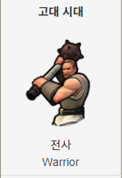
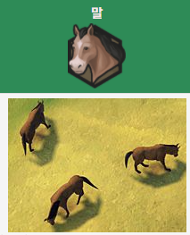
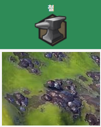

# 광대 created by ms  
## Season 2

 

[1.게임명: 광대](#광대)  
[2.컨셉](#컨셉)  
[3.영상자료](#)  
[4.대표 이미지](#대표-이미지)  
[5.광대 게임 구성요소](#광대-게임-구성요소)  

[6.게임시스템디자인](#게임시스템디자인)  
   -  [a.게임 오브젝트 분해](#게임-오브젝트-분해)  
   -  [b.파라미터(속성)](#파라미터속성)  
   -  [c.행동](#행동)  
   -  [d.상태](#상태)  
   -  [e.플레이어 캐릭터 속성(파라미터)](#플레이어-캐릭터-속성파라미터)  
   -  [f.게임의 규칙](#게임의-규칙)  
   -  [g.게임에서 사용될 공식](#게임에서-사용될-공식)  
   
[7.개발 요구사항 & 흐름도](#개발-요구사항--흐름도) 
   -  [b.요구사항(12주)](#요구사항12주)  
   -  [c.키보드 이벤트에 대한 흐름도](#키보드-이벤트에-대한-흐름도)  
   -  [d.용어정리](#용어정리)  
   
[8.12주간 계획표](#12주간-계획표)  

   

# 개발 진행도  

    

# 컨셉  

## Main Concept

> 종합게임(2종류)

 

개발시나리오  

 

편리함
-> 언컨택트 시대에 남녀노소 pc없이 모바일을 통해서 게임을 즐길수 있는 편리함 추구  

 

2. 다양성
-> 종합게임이라는 타이틀과 지속적인 업데이트를 통해 여러가지 게임을 경험할수있음  

 

3. 경쟁
-> 종합게임의 특징중 하나인 경쟁을 통해서 성취감 형성  

  

## Sub concept

> 화투게임(고스톱)

- 카드를 가지고 정해진 규칙에 따라 자신만의 덱을 만들어 상대와 대전하고, 자유롭게 카드 소유자끼리 본인들이 원하는 조건하에 카드를 거래할 수 있는 게임  

   

- 화투 게임안의 요소  

- 스토리 도입  (ex 승리시 광대의 하수인이 들고있는 지도의 조작을 얻게됨)  

-  랭킹 시스템 도입  

-  멀티 플레이 시스템 도입  

-  bgm: 조선시대 음성과 배경음 삽입예정  

  

> 테트리스 게임 

 

  

테트리스 게임안의 요소  

-  스토리 도입 (ex 승리시 광대의 하수인이 들고있는 지도의 조작을 얻게됨)  
 
-  랭킹 시스템 도입  
    
-  멀티 플레이 시스템 도입  
 
-  데스매치  ex) 시작후 10분경과시 다음수는 10초안에 둬야함  

  

> 오목게임

 

 

오목 게임안의 요소  

-  스토리 도입  (ex 승리시 광대의 하수인이 들고있는 지도의 조작을 얻게됨)  

-  랭킹 시스템 도입  

-  멀티 플레이 시스템 도입  
 
-  시각적포인트를 줄예정(ex 게임속 메인배경)

  

# 영상자료

  

> 고스톱 유니티 관련 영상자료  

[출처: users unity](https://www.youtube.com/watch?v=fZAH-63qk_E)

> 테트리스 유니티 제작 관련 영상자료  

[출처: valem](https://www.youtube.com/watch?v=mdhnwzniqRI)

  

# 대표 이미지  

## 시작화면  

> UI 설명  

  

- 배경은 한국민속배경을 도입할 예정 현재배경과 유사하게 할예정입니다  

- 메인화면에는 Game start, Setting, Tutorial라는 버튼 3개가있습니다  

## 플레이화면  

> UI 설명  

  

 

- 상단에 설정ui 삽입예정(ex 취소, 최소화, 환경설정옵션) 및 상대편 유저캐릭터와
상대편의 패가 보여짐  

- 중단에는 1:1 대결로서  화투패의 모습이 나오게됨  

- 하단에는  ‘나’의 캐릭터와 ‘나’의 패가 보여지게됨  
 

 

# 광대 게임 구성요소

## 메커니즘

[도전과제]

[도전과제]

-  메인 퀘스트를 진행하면서 지도를 완성시켜라  

-  지도 완성후 여주인공을 구출하라  

   

 > 룰  

- 기존의 고스톱, 테트리스와 동일  but  데스메치,  돌발퀴즈등  룰 추가

 

## 기술
  

 

## 스토리  

  

 

## 참신함  

-  고전적인 스토리 진행방식이 아닌 반전 스토리 진행방식을 채택하여 게임 몰입도를 올린점.  

-  또한 기존게임의 진행방식의 룰에 +@(데스메치 등)하여 차별성을 둔점  
 
 

## 미적요소

> 디자인  

메인Ui에  한국과 미국의 고유배경을 씀  

Ex) 메인배경: 경복궁 유사그림 / 보스맵: 뒷배경을    꽃풍경  

> 컬러  

메인Ui : 각 퀘스트 진행도에 따라 배경이 바뀜 / 설정을 통해서 메인UI를 고정시킬수있음  

ex) Quest: 광대(User)가 000npc와 동행하여 000던전클리어  

> 음향 - 저작권 범위내에서 선별예정  

Menu sound: 한국 고유의 전통악기를 베이스로 하여 한국전통악기를 알릴예정  

Main ui sound: 각 나라의 고유 악기를 베이스로 하여 만듬  

war sound: 긴장감 넘치는 일렉음악을 삽입

     

# 게임시스템디자인

# 게임 오브젝트 분해  
> 구성요소 분석

|연변|오브젝트 이름|오브젝트 이미지|  
|:---:|:---|:---:|
|1|건설자,  개척자| |  
|2|군사유닛||  
|3|종교유닛||  
|4|정찰유닛||  
|5|맵||  
|6|자원| | 

  

# 파라미터(속성)  
>속성 뽑아 보기

|속성|속성값|설명|비고|  
|:---:|:---|:---:|---|  
|이름|건설자|||  
|생산 비용|50 (생산력)|||  
|유지비용|없음|||  
|구매 비용|100 (금)|이후 +20금씩 비용 늘어남||  

 

|속성|속성값|설명|비고|  
|:---:|:---|:---:|---|  
|이름|개척자|||  
|생산 비용|100 (생산력)|||  
|유지비용|없음|||  
|구매 비용|450 (금)|이후 +100금씩 비용 늘어남||  

 

|속성|속성값|설명|비고|  
|:---:|:---|:---:|---|  
|이름|전사|||  
|생산 비용|40 (생산력)|||  
|유지비용|없음|||  
|구매 비용|150 (금)|||  

 

|속성|속성값|설명|비고|  
|:---:|:---|:---:|---|  
|이름|선교사|||  
|생산 비용|30 (신앙력)|||  
|유지비용|없음|||  
|구매 비용|100 (신앙)|||  

 

|속성|속성값|설명|비고|  
|:---:|:---|:---:|---|  
|이름|정찰병|||  
|생산 비용|20 (생산력)|||  
|유지비용|없음|||  
|구매 비용|110 (금)|||  

 

|속성|속성값|설명|비고|  
|:---:|:---|:---:|---|  
|이름|맵|||  
|면적|총 4개의 면적|소형, 중형, 대형, 초대형||
|지형특성|총 4개의 특성|고지, 판게아, 대륙, 지구맵||  
|재앙강도|총 7단계|제작중||  
|자원빈도|총 3단계|희박, 보통, 풍족||  

    

# 행동  

1)오브젝트 이름: 건설자  

|행동|설명|  
|:--:|:--|  
|이동력|2타일|  
|건설 가능횟수|2회|  
|요새 건설가능횟수|2회|  
|도로 건설가능횟수|2회|  

 

1)오브젝트 이름: 개척자  

|행동|설명|  
|:--:|:--|  
|이동력|2타일|  
|건설 가능횟수|2회|  

   

2)오브젝트 이름: 군사유닛(근접)  

|행동|설명|  
|:--:|:--|  
|이동력|근접: 2타일, 경기병: 4~5타일, 중기병: 2~4타일|  
|근접 전투력|초반 20전투력 시대마다 20씩오름|  
|원거리 전투력|없음|  
|공격범위|1타일|  

 

3)오브젝트 이름: 군사유닛(원거리)  

|행동|설명|  
|:--:|:--|  
|이동력|원거리:2타일~3타일, 공성무기: 2타일, 성:2타일|  
|근접 전투력|초반 10전투력 시대마다 15씩오름|  
|원거리 전투력|초반 30전투력 시대마다 20씩오름(포격 전투력도 마찬가지)|  
|공격범위|2~3타일(유닛보너스로 최대 +2범위증가)|  

 

4)오브젝트 이름: 종교유닛  

|행동|설명|  
|:--:|:--|  
|이동력|3타일 ~ 5타일|  
|신앙력|선지자: 200 , 사도: 최대 130, 선교사:50|  
|개종|최소 2회~ 최대6회|  

 

3)오브젝트 이름: 정찰유닛  

|행동|설명|  
|:--:|:--|  
|이동력|3타일|  
|근접 전투력|초반 15전투력 시대마다 15씩오름|  
|원거리 전투력|초반 20전투력 시대마다 10씩오름|  
|공격범위|1~2타일|  

    

# 상태  

1) 전투 유닛  

|현상태|전이상태|전이조건|  
|:---:|:---|---|  
|전투|부상|currentHealthPoints = currentHealthPoints - x;|  
|부상|회복|currentHealthPoints = currentHealthPoints  + x;|  
|정상|전투|public Combat unit attack(GameObject unit, GameObject enemy)  ....|  
|전투|사망|if(other.gameObject.tag ==   " die"){health  =  0;}|  

 

2) 비전투 유닛  

|현상태|전이상태|전이조건|  
|:---:|:---|---|  
|정상|이동|tile.translate(moveDir.normalized * movespeed * Time.deltaTime, space.Self);|  
|이동|부상|currentHealthPoints = currentHealthPoints - x;|  
|부상|회복|currentHealthPoints = currentHealthPoints  + x;
|부상|사망|if(other.gameObject.tag ==   " die"){health  =  0;}|  

  

# 플레이어 캐릭터 속성(파라미터) 

|속성|영문명칭|설명|비고|  
|-----|:----|----|----|  
|레벨|Level|유닛마다 레벨이 있으며 전투시 얻은 Wp(warPoint)를 통해 진급할 수 있다.||  
|경험치|Exp|전투를 통해서 경험을 쌓을 수 있다 다만 종교유닛의 경우 전투가 아닌 건물 업그레이드를 통해서 진급가능하다.|유닛처치시 3~5(random)exp  포격시 : 5exp , 성 점령시: 20exp|  
|체력|Hp|유닛마다 고유의 체력을 가진다 다만 종교유닛의 경우 회복을 하기 위해서 성지로 가야한다.|시대변화수치: 근접: +20h, 원거리: +10hp|  
|진급|Upgrade|진급은 총 4진급으로 구성되어있으며 근접, 원거리, 포격유닛, 종교유닛 총 4개의 트리로 구성되어있다.|ex) 창병3진급 : 경기병 상대시 +7전투력|  
|이동력|Mobility|타일을 이동하기위해서 필요한 시스템이다 다만 언덕과 숲등에서는 패널티가 존재한다.|근접, 원거리는 기본 2타일 , 정찰유닛, 종교유닛은 3타일 이동가능하다 이는 진급을 통해서 늘릴 수 있다.|  
|전투력|Power|유닛의 전투력을 나타내는 수치이다 진급과 시대변화를 통해서 올릴 수 있다.|시대변화수치: 근접: +20 전투력, 원거리: +10 전투력, 포격: +10 전투력|  
|경계|boundary|유닛 경계시 적이 1타일 이내로 들어올시 자동으로 전투준비를 할 수 있는 시스템이며 다음턴에 공격가능하다.||  
|방어|Df|유닛마다 고유의 df값이 있으며 적에게 받는 피해들을 받아내는 시스템.|시대변화수치: 근접: +10df, 원거리: +5df|  

  

# 게임의 규칙  

1) 핵심
- 승리와 패배의 조건
승리조건: 
1. 해당 Round마다 지도조각을 획득(총2개)
2. 지도를 완성시킨후 최종보스 처치

패배조건
1. 해당 Round마다 남주인공의 hp를 완전히 소모시 Game over 화면출력

  

# 게임에서 사용될 공식  

  

# 개발 요구사항 & 흐름도

    

# 요구사항(12주)  

 

1. Scean 기능 요구사항
-  메뉴화면, 게임화면, 엔딩화면 총 3개의 화면이 있어야한다.
-  메뉴화면에는 Game start, Setting, Tutorial 3개의 버튼이 있어야한다.
-  Game scean에서 save&load 기능이 있어야한다.
-  Setting Scean 안에는 소리설정 기능이 있어야한다.  

 

2. Characher 기능 요구사항
- characher 방향전환 기능이 있어야한다.
- characher jump 기능이 있어야한다.
- characher dash 기능이 있어야한다.
- characher 시선전환 기능이 있어야한다.
- characher Rigidbody 기능이 있어야한다.
- characher Attack 기능이 있어야한다.
- characher weapon upgrade 기능이 있어야한다. 
- characher armor upgrade 기능이 있어야한다.  
- characher Stats창이 있어야한다
- characher inventory 기능이 있어야한다.
- characher death & resurrection 기능이 있어야한다.  

 

3. Monster 기능 요구사항
- Monster 방향전환 기능이 있어야한다.
- Monster  jump 기능이 있어야한다.
- Monster  기능이 있어야한다.
- Monster  Rigidbody 기능이 있어야한다.
- Monster  Attack 기능이 있어야한다.
- Monster  weapon upgrade 기능이 있어야한다. 
- Monster  armor upgrade 기능이 있어야한다.  
- Monster death 기능이 있어야한다.  

    

# 키보드 이벤트에 대한 흐름도  

# 용어정리  

# 12주간 계획표  

-------------------- 재정비 기간 ------------------------
1주차 – word, ppt, git hub  게임 시스템 디자인 파트까지 완성목표
2주차 – word, ppt, git hub  요구사항(12주차)까지 완성
-------------------- 디자인(prefabs) 제작 기간 -------------------
3주차 – menu scean, map1 scean, map2 scean 완성목표
4주차 – 캐릭터 5종 틀 완성목표(남,여주인공 / 광대 / 제 1,2 단장)
5주차 – 캐릭터 5종 틀+살 완성목표 , 몬스터 틀+살 완성목표(근접, 원거리)
-----------------   프로그래밍 제작 기간 -----------------
6주차 – 게임 인터페이스 구현(환경설정, 메인bgm삽입, 종료)
7주차 – character script 구현(방향전환, 시선전환)
8주차 – weapon and weapon sway 구현
9주차 – system manager script , ActionController script 구현
10주차 – item, enemy,sound manager 구현 
11주차 – 디버깅 작업
12주차 – 영상 작업
